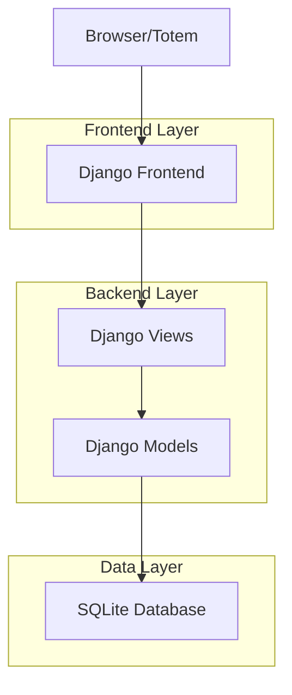
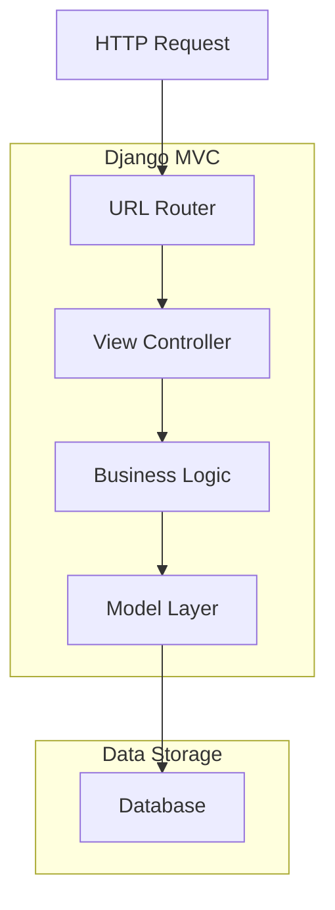
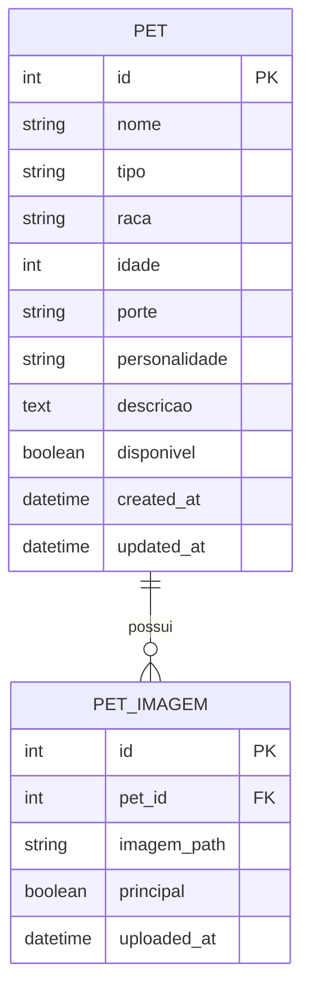

## 1. Arquitetura do Sistema



## 2. Descrição das Tecnologias

- **Backend**: Django 5.2.8
- **Frontend**: Django Templates + Bootstrap 5.3
- **Database**: SQLite (desenvolvimento) / PostgreSQL (produção)
- **CSS Framework**: Bootstrap 5.3 com customizações
- **JavaScript**: Vanilla JS para interações
- **Python**: 3.9+

## 3. Definições de Rotas

| Rota | Descrição |
|------|-----------|
| / | Tela inicial do totem |
| /comecar/ | Iniciar fluxo de decisão |
| /pergunta/<int:step>/ | Perguntas do fluxo de decisão |
| /resultados/ | Lista de pets recomendados |
| /pet/<int:pet_id>/ | Detalhes do pet |
| /cadastrar-pet/ | Formulário de cadastro de pet |
| /admin/ | Interface administrativa Django |

## 4. Definições de API

### 4.1 Endpoints Principais

**Calcular Compatibilidade**
```
POST /api/calcular-compatibilidade/
```

Request:
| Parâmetro | Tipo | Obrigatório | Descrição |
|-----------|------|-------------|-----------|
| tipo_preferido | string | sim | 'cachorro' ou 'gato' |
| porte_preferido | string | sim | 'pequeno', 'medio' ou 'grande' |
| idade_preferida | string | sim | 'filhote', 'adulto' ou 'idoso' |
| personalidade | array | sim | ['calmo', 'ativo', 'brincalhao'] |

Response:
```json
{
  "pets_compatíveis": [
    {
      "id": 1,
      "nome": "Rex",
      "tipo": "cachorro",
      "raca": "Golden Retriever",
      "compatibilidade": 95,
      "imagem_url": "/static/images/rex.jpg"
    }
  ],
  "total_encontrados": 1
}
```

**Cadastrar Pet**
```
POST /api/cadastrar-pet/
```

Request:
| Parâmetro | Tipo | Obrigatório | Descrição |
|-----------|------|-------------|-----------|
| nome | string | sim | Nome do pet |
| tipo | string | sim | 'cachorro' ou 'gato' |
| raca | string | sim | Raça do pet |
| idade | integer | sim | Idade em anos |
| porte | string | sim | 'pequeno', 'medio' ou 'grande' |
| personalidade | string | sim | Descrição da personalidade |
| imagem | file | não | Foto do pet |

## 5. Arquitetura do Servidor



## 6. Modelo de Dados

### 6.1 Diagrama ER



### 6.2 Definição das Tabelas

**Tabela de Pets (pets)**
```sql
CREATE TABLE pets (
    id INTEGER PRIMARY KEY AUTOINCREMENT,
    nome VARCHAR(100) NOT NULL,
    tipo VARCHAR(20) NOT NULL CHECK (tipo IN ('cachorro', 'gato')),
    raca VARCHAR(100) NOT NULL,
    idade INTEGER NOT NULL CHECK (idade >= 0 AND idade <= 30),
    porte VARCHAR(20) NOT NULL CHECK (porte IN ('pequeno', 'medio', 'grande')),
    personalidade TEXT NOT NULL,
    descricao TEXT,
    disponivel BOOLEAN DEFAULT TRUE,
    created_at DATETIME DEFAULT CURRENT_TIMESTAMP,
    updated_at DATETIME DEFAULT CURRENT_TIMESTAMP
);

-- Índices para performance
CREATE INDEX idx_pets_tipo ON pets(tipo);
CREATE INDEX idx_pets_porte ON pets(porte);
CREATE INDEX idx_pets_idade ON pets(idade);
CREATE INDEX idx_pets_disponivel ON pets(disponivel);
```

**Tabela de Imagens (pet_imagens)**
```sql
CREATE TABLE pet_imagens (
    id INTEGER PRIMARY KEY AUTOINCREMENT,
    pet_id INTEGER NOT NULL,
    imagem_path VARCHAR(255) NOT NULL,
    principal BOOLEAN DEFAULT FALSE,
    uploaded_at DATETIME DEFAULT CURRENT_TIMESTAMP,
    FOREIGN KEY (pet_id) REFERENCES pets(id) ON DELETE CASCADE
);

CREATE INDEX idx_imagens_pet_id ON pet_imagens(pet_id);
```

## 7. Algoritmo de Compatibilidade

### 7.1 Sistema de Pontuação

```python
def calcular_compatibilidade(pet, preferencias):
    pontuacao = 0
    
    # Tipo (0-40 pontos)
    if pet.tipo == preferencias['tipo']:
        pontuacao += 40
    
    # Porte (0-25 pontos)
    porte_compatibilidade = {
        'pequeno': {'pequeno': 25, 'medio': 15, 'grande': 5},
        'medio': {'pequeno': 15, 'medio': 25, 'grande': 15},
        'grande': {'pequeno': 5, 'medio': 15, 'grande': 25}
    }
    pontuacao += porte_compatibilidade[preferencias['porte']][pet.porte]
    
    # Idade (0-20 pontos)
    if pet.idade <= 2 and preferencias['idade'] == 'filhote':
        pontuacao += 20
    elif 3 <= pet.idade <= 7 and preferencias['idade'] == 'adulto':
        pontuacao += 20
    elif pet.idade > 7 and preferencias['idade'] == 'idoso':
        pontuacao += 20
    
    # Personalidade (0-15 pontos)
    palavras_chave = preferencias['personalidade'].lower().split(',')
    for palavra in palavras_chave:
        if palavra.strip() in pet.personalidade.lower():
            pontuacao += 5
    
    return min(pontuacao, 100)
```

## 8. Fluxo de Decisão

### 8.1 Perguntas do Fluxo

1. **Tipo de Pet**: "Você prefere um cachorro ou um gato?"
   - Opções: Cachorro, Gato, Ambos

2. **Porte**: "Qual porte você prefere?"
   - Opções: Pequeno, Médio, Grande, Sem preferência

3. **Idade**: "Qual faixa etária você prefere?"
   - Opções: Filhote (0-2 anos), Adulto (3-7 anos), Idoso (8+ anos), Sem preferência

4. **Personalidade**: "Qual personalidade combina mais com você?"
   - Opções: Calmo e tranquilo, Ativo e energético, Brincalhão e sociável, Sem preferência

5. **Tempo Disponível**: "Quanto tempo você pode dedicar ao pet?"
   - Opções: Pouco tempo, Tempo moderado, Muito tempo

### 8.2 Caminhos de Decisão

**Caminho 1 - Família com Crianças**
- Tipo: Cachorro
- Porte: Médio/Grande  
- Idade: Filhote/Adulto
- Personalidade: Brincalhão
- Recomendações: Golden Retriever, Labrador, Beagle

**Caminho 2 - Apartamento Pequeno**
- Tipo: Gato ou Cachorro pequeno
- Porte: Pequeno
- Idade: Adulto
- Personalidade: Calmo
- Recomendações: Persa, Siamês, Shih Tzu, Poodle toy