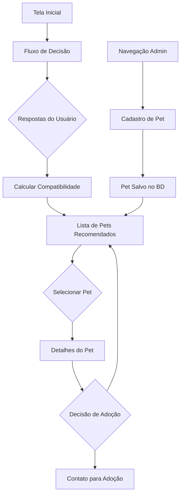

## 1. Visão Geral do Produto

Sistema de totem de autoatendimento para pets que permite aos usuários encontrar animais disponíveis para adoção através de um fluxo de decisão interativo. O sistema cadastra pets (cachorros e gatos) e fornece recomendações personalizadas baseadas nas preferências do usuário.

**Problema:** Dificuldade em encontrar pets compatíveis com o perfil e preferências dos adotantes em abrigos e pet shops.
**Solução:** Interface intuitiva que guia o usuário através de perguntas e recomenda pets compatíveis.
**Público-alvo:** Visitantes de abrigos, pet shops e feiras de adoção.

## 2. Funcionalidades Principais

### 2.1 Páginas do Sistema
O sistema de totem de autoatendimento consiste nas seguintes páginas principais:

1. **Tela Inicial**: Apresentação do sistema com botão para iniciar o processo
2. **Fluxo de Decisão**: Sequência de perguntas com múltiplas escolhas
3. **Cadastro de Pet**: Formulário para registrar novos pets
4. **Lista de Pets Recomendados**: Exibição dos pets compatíveis
5. **Detalhes do Pet**: Informações completas do pet selecionado

### 2.2 Detalhamento das Páginas

| Nome da Página | Módulo | Descrição das Funcionalidades |
|----------------|---------|-------------------------------|
| Tela Inicial | Hero Section | Logo do sistema, imagem de pets, botão "Começar" |
| Tela Inicial | Navegação | Acesso ao cadastro de pets (modo admin) |
| Fluxo Decisão | Perguntas Sequenciais | 4-5 perguntas sobre preferências (tipo, porte, idade, personalidade) |
| Fluxo Decisão | Sistema de Pontuação | Algoritmo que calcula compatibilidade baseado nas respostas |
| Cadastro Pet | Formulário | Campos: nome, tipo, raça, idade, porte, personalidade, foto |
| Cadastro Pet | Validação | Validação de campos obrigatórios e formatos |
| Lista Pets | Grid de Cards | Cards com foto, nome, tipo e botão "Ver Detalhes" |
| Lista Pets | Filtros Ativos | Mostra critérios usados na busca |
| Detalhes Pet | Galeria de Fotos | Carrossel de imagens do pet |
| Detalhes Pet | Informações | Dados completos: nome, idade, raça, personalidade, histórico |
| Detalhes Pet | Ações | Botões "Quero Adotar" e "Voltar para Lista" |

## 3. Fluxo Principal do Usuário

### Fluxo de Descoberta de Pets
1. Usuário chega na tela inicial do totem
2. Clica em "Começar" para iniciar o processo
3. Responde 4-5 perguntas sobre preferências de pet
4. Sistema calcula compatibilidade e mostra lista de pets recomendados
5. Usuário seleciona um pet para ver detalhes
6. Visualiza informações completas e decide sobre adoção

### Fluxo de Cadastro de Pets (Administrativo)
1. Acessar área de cadastro através da navegação
2. Preencher formulário com dados do pet
3. Fazer upload de fotos
4. Salvar pet no banco de dados
5. Pet aparece nas buscas futuras

## 4. Design da Interface

### 4.1 Estilo Visual
- **Cores Primárias**: Azul petróleo (#2C5282) e verde menta (#68D391)
- **Cores Secundárias**: Branco (#FFFFFF) e cinza claro (#F7FAFC)
- **Botões**: Estilo arredondado com sombra suave
- **Tipografia**: Helvetica para títulos, sistema sans-serif para texto
- **Layout**: Card-based com navegação superior
- **Ícones**: Estilo outline, temas de pets e corações

### 4.2 Elementos por Página

| Página | Módulo | Elementos de UI |
|--------|---------|-----------------|
| Inicial | Hero | Background com pets, logo centralizado, botão CTA grande |
| Decisão | Perguntas | Cards com opções, progress bar, botões navegação |
| Lista | Cards | Grid responsivo, cards com hover effect, badges de compatibilidade |
| Detalhes | Galeria | Carrossel touch-friendly, thumbnails navegáveis |

### 4.3 Responsividade
- **Desktop-first**: Otimizado para telas de totem (1920x1080)
- **Mobile-adaptativo**: Funcional em tablets e smartphones
- **Touch-optimized**: Botões grandes para interação tátil
- **Acessibilidade**: WCAG 2.1 AA compliance, alto contraste